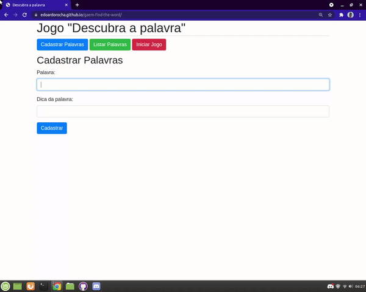
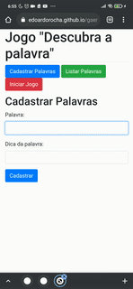

<h1 align="center"> game find the word </h1>
 
 
 
 
 
 
 
 

 
 
 > status: Concluded ✔️
 
 
 
 ## How to use this algorithm?

1. register the word
     + In the first part of the game you must register the word with the hint to be displayed, just write the hint and the word in the indicated places. To complete the registration you must click on "Register" and a message of registration completed will be displayed.
2. list the words
     + To list the words you must go to "List all", But not to show the word right away I created the option "Show all" by checking this checkbox all the tips and words will appear inside an HTML table. Then you can see the words and still be able to delete one or more lines.
3. Start the game
     + Entering the part of playing itself, the system will draw a word that was registered in the beginning of the game. Well the game itself is the simplest, you will only have to play a letter to hit the word itself. You can also ask for the hint but this will cost you a chance so think carefully before asking for the hint 😉.

## What does this algorithm consist of?

This program was made for places with large audiences such as theaters, cinemas and even operas. It will help the customer save their seat for the show.

## Technologies used

<table> 
 <tr>
  <td>JavaScript</td>
  <td>HTML</td>
  <td>CSS</td>
  <td>Bootstrap</td>
 </tr>
 <tr> 
  <td> ECMAS v8.0</td>
  <td> v5.0 </td>
  <td>v3.0</td>
  <td>v4.0.0</td>
 </tr>
</table>

## License
Repository covered by [MIT](http://escolhaumalicenca.com.br/licencas/mit/) lic
